# Risc-V
As illustrated below, Lepton is operational on a Litex Risc-V SoC implemented on the Tang Nano 20k FPGA board.

| Litex SoC configuration  | Linux on Litex           |
:-------------------------:|:-------------------------:
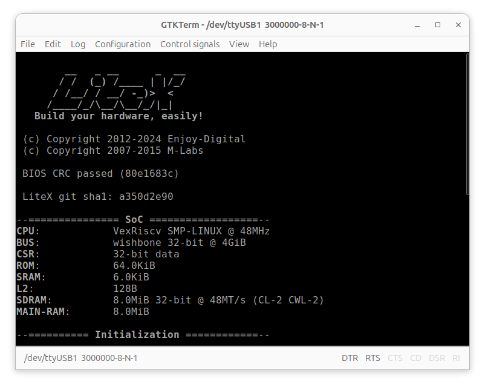 | 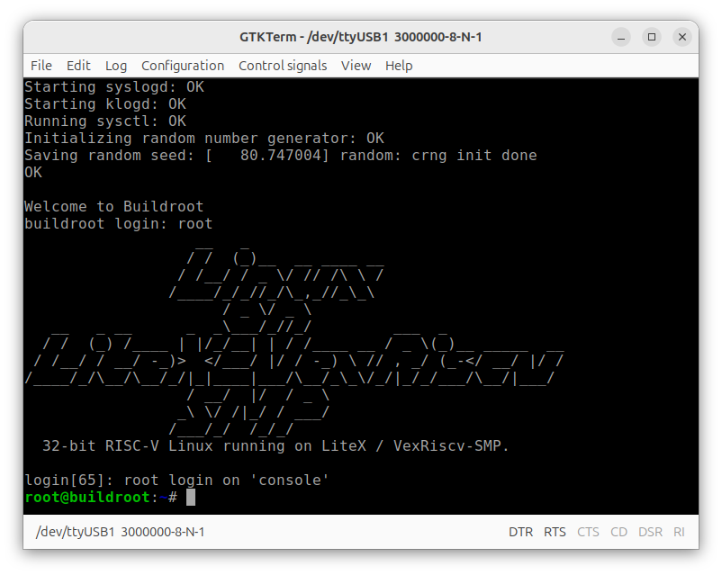

| Bell circuit diagram     | Bell simulation          |
:-------------------------:|:-------------------------:
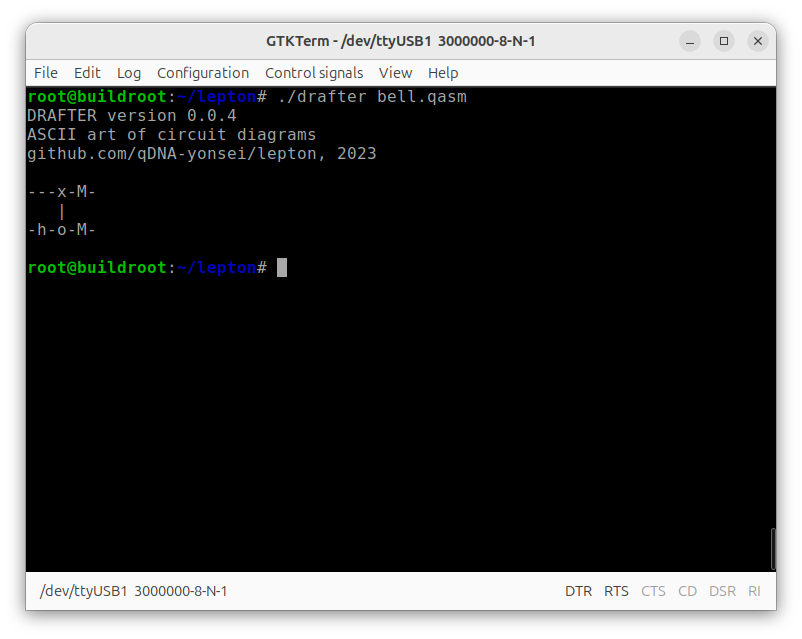 | 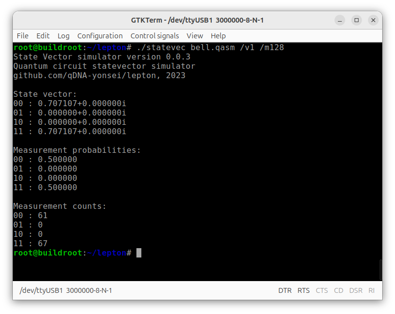

| MCNOT circuit diagram    | MCNOT simulation         |
:-------------------------:|:-------------------------:
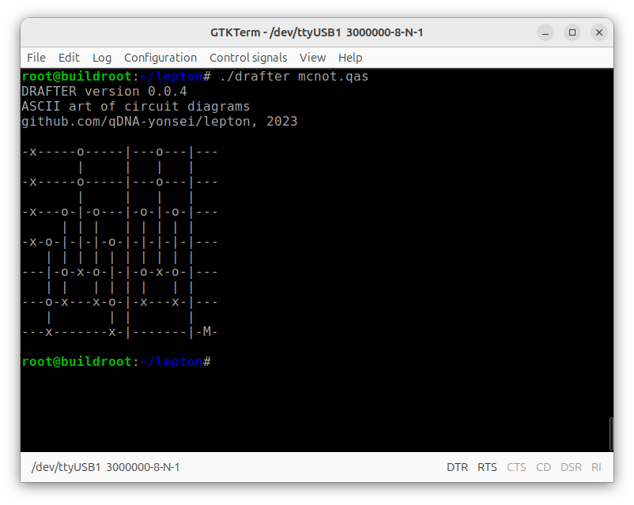 | 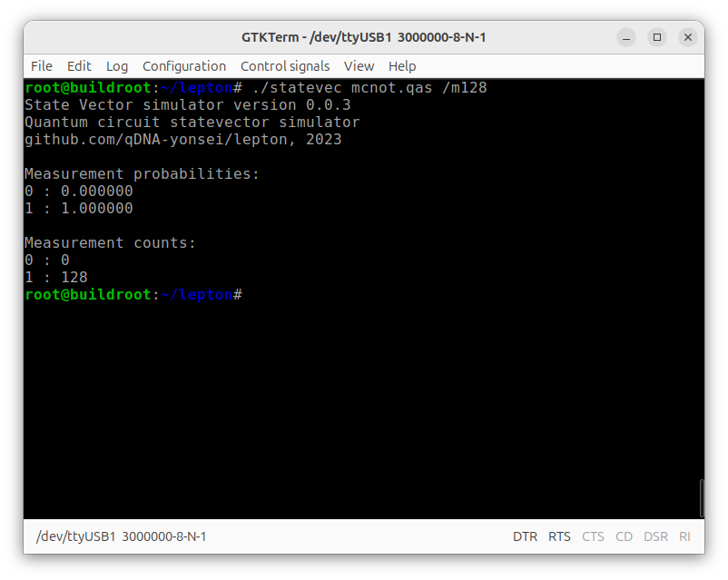

Linux on LiteX-VexRiscv:
https://github.com/litex-hub/linux-on-litex-vexriscv

Tang Nano 20k:
https://wiki.sipeed.com/hardware/en/tang/tang-nano-20k/nano-20k.html

# ARM
Lepton is also functional on the Raspberry Pi 3 Model B Rev. 1.2, demonstrating its flexibility across different platforms.

| System configuration     | 24-qubit GHZ state       |
:-------------------------:|:-------------------------:
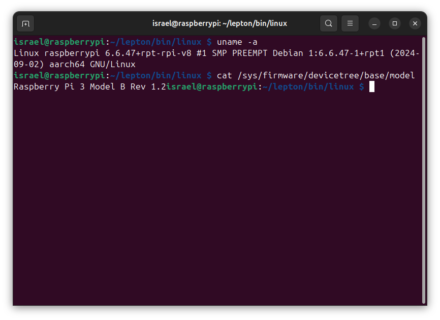 | 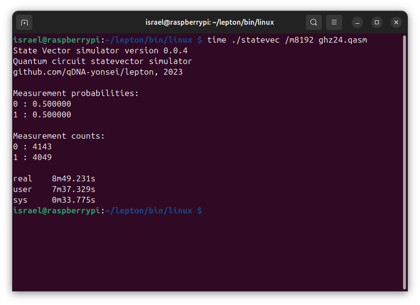

| Bell circuit diagram     | Bell simulation          |
:-------------------------:|:-------------------------:
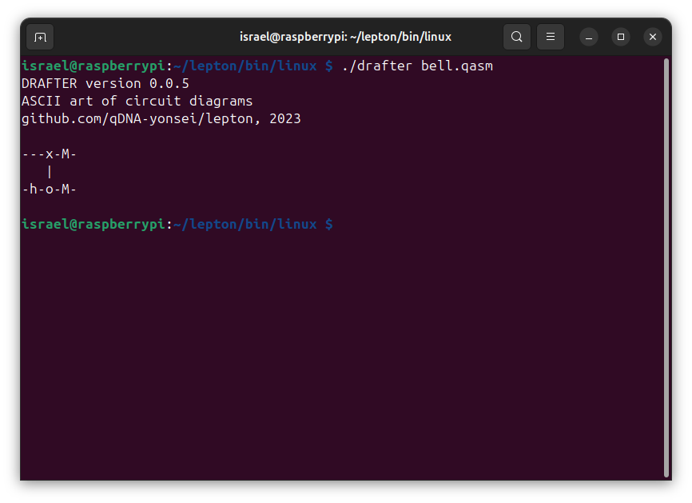 | 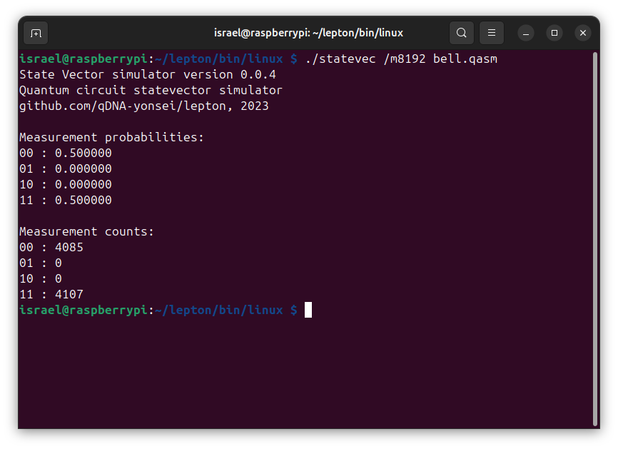

| MCNOT circuit diagram    | MCNOT simulation         |
:-------------------------:|:-------------------------:
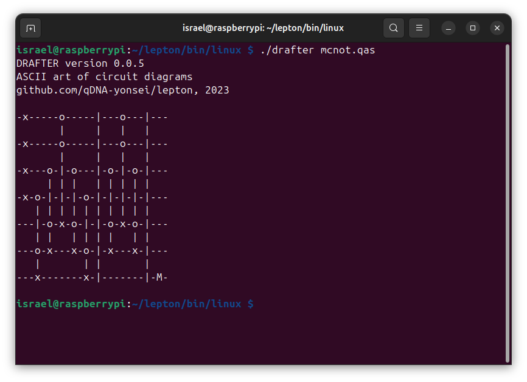 | 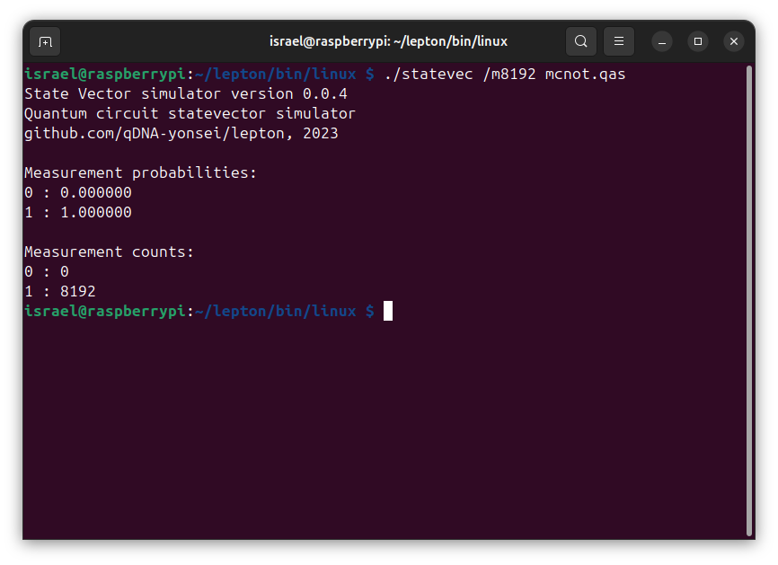

Raspberry Pi 3 Model B+:
https://www.raspberrypi.com/products/raspberry-pi-3-model-b-plus

GHZ state:
https://en.wikipedia.org/wiki/Greenberger%E2%80%93Horne%E2%80%93Zeilinger_state
